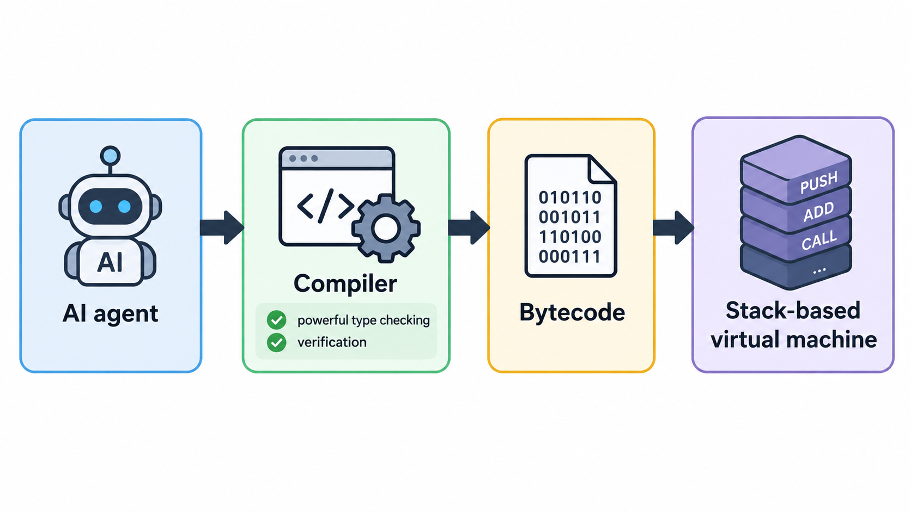

# lang

in progress programming language project (fr this time)

- Currently implementing a bytecode interpreter using stack based vm. Rn bytecode supports ints, arrays, conditionals, functions, recursion

- Eventually add a compiler n shi

